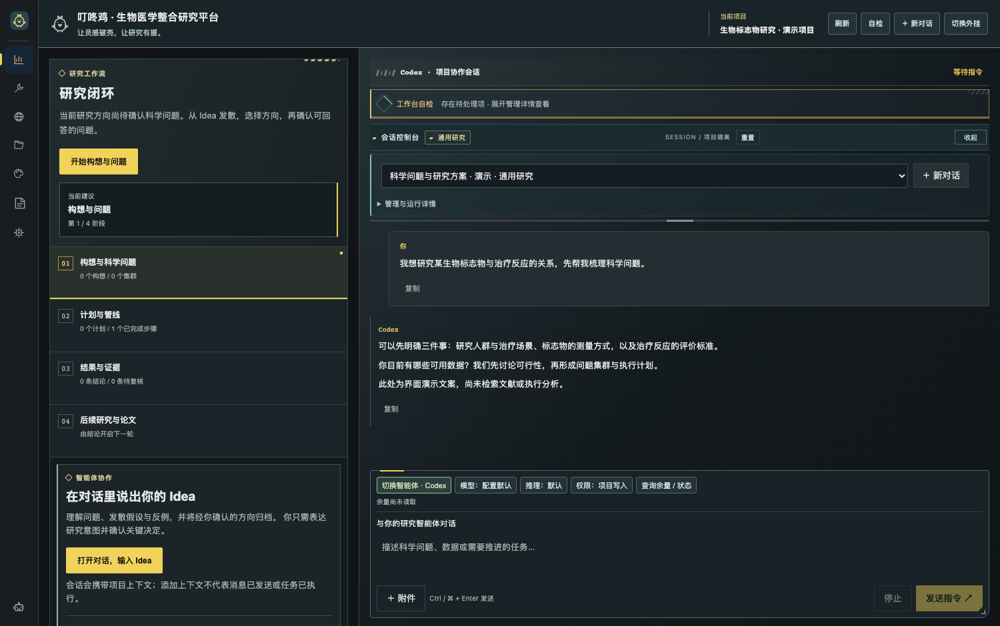
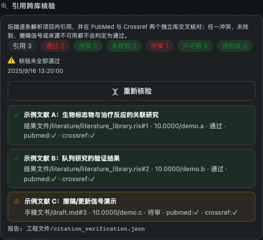

# 叮咚鸡 V2.4

**生物医学整合研究平台 · 首版**

### 让灵感破壳，让研究有据。

把科学想法、智能体对话、研究执行与证据管理放进同一个项目。从提出问题开始，一直走到可追溯结论与论文准备。

[了解工作机制](#工作机制) | [新手入门](#新手入门) | [使用须知](#使用须知)



*界面使用真实前端组件与演示数据展示，未连接模型，不代表真实研究结果。*

## 叮咚鸡是什么

叮咚鸡是运行在 VS Code 中的生物医学研究整合平台，也是供智能体调用的研究基础设施。它围绕一个项目，把研究问题、计划、数据、工具、结论与手稿组织起来。

**智能体负责理解、讨论与执行；叮咚鸡负责组织状态、记录过程与连接证据；研究者负责判断、授权与确认。**

你可以从一个尚不成熟的想法开始，也可以带着已有数据、分析任务或手稿进入。叮咚鸡帮助你回答研究过程中的几个实际问题：现在研究什么？下一步做什么？已经产出了什么？结论依据在哪里？换一个会话后怎样继续？

它不是独立的大语言模型，也不是安装后就具备全部科研环境的万能工具。模型、检索服务与计算工具按项目需要配置，由工作台将它们连接到研究流程中。

### 适合什么工作

- **选题与立项**：讨论研究价值、发散假设，收敛为可回答的科学问题。
- **文献与证据整理**：在检索工具就绪后组织查阅、筛选与证据记录。
- **数据分析与科研计算**：将分析任务、脚本、运行结果与质量检查纳入计划。
- **持续研究与论文准备**：从结果提炼核心结论，追溯证据，整理手稿与作者信息。

具体研究方法和工具支持取决于已安装的技能、后端环境及外部服务。平台提供组织与协作能力，不承诺任意研究任务都能自动完成。

## 工作机制

### 用科学问题贯穿整个项目

```text
科学 Idea → 发散讨论 → 确立问题集群 → 制订计划并执行
                                          ↓
后续研究与论文撰写 ← 可追溯科学结论 ← 分析结果与证据
        └──────── 带着新问题进入下一轮研究 ────────┘
```

**讨论形成方向。** 在对话中提出想法，智能体协助梳理背景、假设、约束与可行性。将确认的方向组织为 Idea 树及科学问题集群，归档后供后续步骤使用。

**计划连接执行。** 科学问题转化为研究计划与管线步骤，组织依赖、任务和产物。具备相应环境与授权时，智能体可以调用工具执行任务；研究者在仪表盘查看状态、检查结果并决定是否推进。

**结果连接证据。** 核心结论与分析结果、文献及其他证据支点关联。提取出的结论仍需审阅，不能把模型生成的解释直接视作科学事实。

**结论回到研究。** 将发现、限制与未解决问题用于下一轮研究，或作为手稿写作的依据。过程可以迭代，不必把所有研究强行压成一次直线任务。

### 对话之外，还有项目记录

叮咚鸡不只依赖聊天窗口记住研究：

- **管线状态**记录当前步骤、允许动作与待交付产物。
- **项目知识与交接班**保存背景、决策和进展，辅助会话接续。
- **产物与审计记录**帮助核对实际文件及其变化。
- **结论与证据链**说明一项结论由哪些结果或来源支撑。

这些记录让“智能体说完成了”可以进一步核对为“文件在哪里、检查了什么、还缺什么”。文件指纹能帮助发现变化，但不能证明研究结论正确，也不是不可篡改认证。

### 项目内切换智能体

内置工作台支持 Codex 与 DeepSeek Harness 接入。会话按项目组织，两个执行器保留各自的原生线程；切换时经确认交接上下文，并保留消息来源。

这是一种**串行接续协作**：你可以让不同智能体接手同一研究讨论，而不必每次从头说明背景。它不等于同时启动多个智能体并行工作，也不自动合并其他客户端的历史。

模型、推理强度、权限和额度信息按执行器实际支持的能力展示。每轮汇报与可展开的工作细节帮助阅读长任务；界面折叠不会代替原始历史记录。

## 核心优势

### 从单次回答，转向持续研究

叮咚鸡的重点不是增加一个聊天入口，而是把对话转化为可以继续推进的项目：问题有归档，任务有状态，结果有位置，后续会话有依据。

### 将研究过程与证据放在一起

计划、执行、审计与结论不是相互独立的备忘录。它们围绕同一项目组织，便于研究者检查研究问题是否得到回答、结论是否有支撑，以及哪些环节仍需补充验证。

### 项目积累不绑定单一执行器

在已支持的智能体之间接续工作，让模型能力与项目记录分开管理。更换执行器时仍能利用项目上下文，而不把全部研究资产都压在某个原生聊天线程里。

### 连接已有研究工具

通过后端、技能和工具接入，把检索、分析、绘图等能力放进研究计划。扩展能力取决于实际环境，不要求用一套固定工具覆盖所有问题。

这些是叮咚鸡的产品设计侧重点，不是性能排名或相对其他产品的量化效果承诺。研究效率仍取决于模型能力、数据质量、工具配置与人工判断。

## 如何降低幻觉与虚假完成的风险

叮咚鸡采用“执行前约束、执行中留痕、完成后核验”的机制。目标不是让模型口头承诺不出错，而是让研究过程有可以检查的依据。

| 研究环节与常见痛点 | 叮咚鸡的约束与核验 | 仍需研究者判断 |
| --- | --- | --- |
| 立项时把猜想当事实 | 提示区分假设、真实观测、模拟数据与未核实内容，保存讨论和选择依据 | 问题价值、创新性与可行性 |
| 文献引用看似可信却查无此文 | 后端逐条解析项目内引用（编号手稿 md/txt/docx、RIS/BibTeX），在 PubMed 与 Crossref 两个独立库交叉核对；冲突、未找到、撤稿或更新信号、来源不可用都不判为通过，并保存逐条报告 | 文献是否支持该论断；核验通过只说明元数据可在两库追溯，不代表论断成立 |
| 跳过步骤、没有产物却宣称完成 | 后端硬约束模式检查必需产物是否存在、非空及受支持格式的基本结构；未达标则拒绝推进 | 产物内容和研究方法是否充分，不能只凭文件名验收 |
| 把工具失败说成成功 | 受控任务保存运行状态与事件；中断状态不自动算成功，候选结论关联实际输入与产物 | 成功退出不等于计算或解释正确 |
| 无证据结论被当作既定事实 | 缺少可核验证据的结论不能标为 supported；未知证据类型不能被静默忽略 | 文件可核验不等于因果或统计论证成立 |
| 分析结果改动后，旧结论仍被引用 | 记录文件指纹；追溯时重新检查文件与运行状态，证据缺失或变化会提示，相关审计失败可阻断推进 | 修改是否合理、是否需要重新分析及重新审阅结论 |



*引用核验卡片使用真实前端组件与合成数据展示；文献条目、DOI 与状态均为占位示例，不代表真实检索结果。*

### 强制检查与提示约定要分清

**后端验收**发生在通过叮咚鸡接口进行状态转换时。硬约束模式会阻止缺少必需产物的推进；软约束不能视为同等级别的强制门禁。已有结论证据失效、图表验收失败等检查，也会影响推进结果。

**工具调用拦截**取决于智能体宿主是否实际安装并调用对应 hook。当前 PreToolUse 规则按本次调用的工作目录寻找管线，并检查 Edit、Write 的目标路径；在硬约束且存在禁止路径时，无法可靠判断写入范围的 Bash 调用会暂停，而不是假装能识别任意脚本。此机制不等于 Codex、Harness 或所有外部工具都受到同一文件沙箱的控制。

**研究真实性提示**随内置智能体任务传递，要求不编造文献、数据或执行结果，不通过改状态、删证据或重写指纹绕过验收。但提示本身不是安全隔离，具备文件写入权限的执行器仍可能绕过应用层规则。

因此，叮咚鸡提供的是可追溯、可检查、部分可强制的研究治理机制，**不是“零 AI 幻觉”保证**。模型解释、来源真实性、方法学、伦理和最终论文仍须人工复核。

## 一个工作台，几种工作方式

### 仪表盘与对话并排

左侧查看研究流程与项目状态，右侧与智能体讨论和执行。分区可直接拖动调整，会话管理可以收起，让讨论和结果检查保持在同一视野。

### 内置与外挂切换

内置形态适合在统一工作台内研究；外挂形态适合配合已有智能体窗口使用。切换界面形态不意味着原生会话历史自动迁移，两者的历史来源需要区分。

### 项目会话与角色预设

在项目内创建、切换、重命名或删除会话，利用审稿人、学术编辑等预设切换讨论角度。角色预设是工作指引，不代表专业资质，也不代替真实同行评审。

### 智能体交互就在对话里

当智能体需要你补充信息时，问题会作为一张卡片出现在对话窗口内：可选按钮、选项说明、自定义输入与“跳过此题”集中呈现，多问题一次看完，提交后再继续执行。

当 DeepSeek Harness 请求权限批准时，请求同样以卡片呈现：显示工具标题、命令或路径等参数，以及 Harness 提供的批准/拒绝选项；“始终允许”用警示色区分，取消等同拒绝。两类卡片在没有内置窗口时分别退回原生逐题输入框和原生模态审批；项目切换、关闭窗口或停止任务会安全结算未完成的交互。

### 投稿准备

全局作者库用于复用作者与机构信息；手稿预览面向**当前工作区**。刷新后提取 `手稿文书/` 与 `结果文件/manuscript/` 中的手稿，便于初步人工审查，并可向受支持的手稿导入确认后的作者信息。

`.docx` 手稿点击后会用已安装的原生查看器（如 WPS / Office Viewer）在侧边列打开真正的 docx 窗口，另有工具栏「原生 docx 窗口」按钮与命令「叮咚鸡：原生预览 docx 手稿」；没有原生查看器时回退到 VS Code 默认打开方式。Markdown/文本仍用面板内文本预览，PDF 使用本机提取器或 PDF 预览。

“投稿管理”用于准备材料，不会自动向期刊提交稿件。文本与原生预览都不等于完整版式或最终排版校验。

## 新手入门

> **先申请接口，再配置研究能力。** 需要授权的数据库、文献检索和搜索 API，须由你在服务提供方手动注册、申请并取得访问资格。凭据保存到本地后端 API 库，不在对话里提交。叮咚鸡提供状态与申请提示，智能体会协助讲解注册教程和配置步骤；它们不能代替账户所有者完成审批或获取数据库授权。

### 准备一个独立项目

先确认已有可用的叮咚鸡扩展、本地后端和至少一个已配置的智能体。当前扩展声明的 VS Code 版本要求为 `^1.125.0`；研究工具还需按任务配置。

在 VS Code 通过“文件 → 打开文件夹”打开一个独立项目，首次体验建议使用无敏感信息的测试目录。不要把多个无关课题都放进同一个工作区。

推荐组织方式：

```text
研究项目/
├── 工程文件/                # 计划、状态、交接班、知识与审计
├── 原始数据/                # 原始资料，保留可恢复副本
├── 结果文件/
│   ├── tables/
│   ├── figures/
│   └── manuscript/
└── 手稿文书/
```

### 打开工作台，确认环境

点击活动栏的叮咚鸡图标，或打开命令面板执行 **叮咚鸡：打开仪表盘**。检查顶部项目名称及自检提示。

首次使用先确认三件事：项目路径正确、后端可用、所选智能体已完成认证。界面能显示，不代表模型、检索与计算工具都已经可用。

### 用一句话开始讨论

选择内置形态，在对话区输入你的想法。不必先写完整研究方案，可以直接使用以下开场：

> 我想研究【主题】，目前有【数据或资源】，希望解决【问题】。请先询问你需要了解的信息，与我讨论研究价值和可行性；确认方向后，再形成 Idea 树、科学问题集群和初步计划。暂时不要运行计算或改写原始数据。

其中的方括号请替换为你的情况。若尚无数据，也可以直接说明。遇到信息不足时，先补充约束，不必催促智能体立即给出结论。

### 确认方向，再允许执行

讨论后检查归档的 Idea 与科学问题是否符合预期。让智能体列出研究计划、所需数据、工具依赖、预期产物及风险，再按需要授权执行。

首次尝试可以只完成“形成问题集群与研究计划”。确认文件和项目状态一致后，再进入需要联网、调用模型或运行计算的阶段。

### 检查产物，继续研究

任务完成后阅读每轮汇报，必要时展开工作细节，并打开实际产物核对。对核心结论检查其证据来源、分析条件及未解决限制。

需要写作时，将手稿放入约定目录，在“投稿管理”中刷新预览。结束前保存文件、检查项目记录；迁移或清理工作区前另行备份会话。

### 遇到问题先看这里

| 现象 | 先检查什么 |
| --- | --- |
| 项目不对或没有项目 | 确认 VS Code 当前打开的文件夹，以及是否设置了默认工作区 |
| 后端不可用 | 检查本地叮咚鸡后端、自检提示及端口 19999；不要因界面已打开就跳过此项 |
| 智能体无法启动 | 检查对应程序是否安装、路径是否正确，以及其认证或模型服务配置 |
| 工具运行失败 | 查看具体工具的依赖、输入路径和权限；不要只重复发送同一任务 |
| 手稿列表为空或无法预览 | 确认文件在扫描目录内，刷新列表，并检查 PDF、Word 转换工具 |

可在 VS Code 设置中搜索 `dingdongji`：

- `dingdongji.codexExecutable`：指定 Codex 程序绝对路径；留空按扩展的发现机制查找。
- `dingdongji.deepseekExecutable`：指定 Harness 程序绝对路径；留空使用 `~/.local/bin/dsh`。
- `dingdongji.defaultWorkspace`：未打开文件夹时的回退目录；新手可先留空，明确打开项目再使用。

## 使用须知

### 环境与服务费用

叮咚鸡扩展不包含完整后端、模型服务、数据库授权或全部科研计算环境。默认本地后端位于 `~/ddj/biomed_bus/`，使用端口 `19999`。缺失相关部署时，需要先完成环境配置，不能仅安装扩展就开始完整研究。

模型、检索或其他服务可能产生各自的费用。界面中的额度或速率限制不是统一账户余额，不支持的指标不会凭空补全。

### 数据库与搜索 API 申请

叮咚鸡不附赠数据库账户、搜索密钥或机构访问资格。需要认证的接口由你手动注册申请；公开、无需认证的资源不必额外申请密钥。

1. 在对话中说明想使用的数据库或搜索服务，让智能体解释其官方申请入口、资格、权限范围与配置步骤；官网政策有变化时应重新核对。
2. 由你在官方站点注册账户，完成邮箱、机构或研究用途等必要审核，并查看额度与费用。
3. 在本机将凭据配置到后端 API 库 `~/ddj/api_keys.json`，按对应服务登记标识及环境变量映射。不要把真实密钥交给智能体填入聊天记录。
4. 回到叮咚鸡查看配置状态并自检。显示“已配置”只说明存在配置，不代表已经获批、账户有余额或接口可用。

可以这样提问：

> 请告诉我【服务名称】的官方注册与 API 申请步骤、需要的材料，以及如何在本机配置到叮咚鸡。请只展示占位符示例，不要求我发送真实密钥。

本地 API 库是凭据配置文件，不是加密保险库。应限制为账户本人读写，避免同步到公开仓库或无保护的网盘。后端对 API 响应及部分运行记录进行脱敏，界面只展示服务配置状态；这不能替代操作系统安全与账户管理。

### 数据与隐私

研究文件保存在项目目录，会话还使用 VS Code 工作区存储。仅复制项目文件夹不保证迁移全部聊天历史；重要记录应另行导出并检查备份。

发送给智能体的输入、附件及交接历史，可能交给其配置的模型服务；检索也可能访问外部服务。本地保存不等于完全离线。涉及患者信息、未公开手稿或受限数据时，应先确认授权、脱敏和相应服务的数据政策，不要把访问密钥放进对话或手稿。

### 授权与自动化

扩展启动时可能启动后端、同步项目上下文及安装或更新智能体接入配置。首次使用应检查写入范围，只对可信项目授权。

各智能体使用各自的权限机制；会话按项目区分不等于操作系统级访问隔离。运行脚本、覆盖文件、联网或提交材料前，应检查具体动作与权限。自动推进不免除研究者的审查责任。

### 科研判断与证据质量

模型可能遗漏条件、误读结果或生成不存在的引文。文献、统计解释和核心结论都需要核验。归档与审计帮助保留依据，不会自动保证可重复性、学术有效性或合规性。

引用核验由后端完成：打开或扫描项目、刷新工作台、保存手稿或 RIS/BibTeX 后会自动排队，24 小时内相同文件指纹复用结果，同一项目同时只跑一个核验任务。它只向固定的 Crossref / NCBI 端点发送公开引用元数据，不发送手稿正文、模型输出或密钥；解析仅支持编号引用的手稿格式，作者-年份或 citekey 格式会标记为“解析覆盖不足”，不会静默当作通过。核验通过是元数据层面的交叉确认，不等于内容正确、统计成立或引用位置恰当，仍需研究者判断。

叮咚鸡用于研究辅助，不替代伦理审查、专业统计审查或临床判断。未经核实的模型输出不应直接用于患者诊疗或正式论文结论。

### 兼容性边界

当前验证以本机 macOS 为主，Windows、Linux 完整流程仍需验证。PDF、Word 文本提取依赖本机转换工具，图片和复杂排版不保证完整保留。

Harness 当前不支持图片附件输入；过长的会话交接会提示拒绝，不会静默截断。Codex 成功轮次后的原生压缩与界面折叠是不同机制，真实模型端到端压缩仍待进一步验证。请以实际状态与错误提示为准，不将这些行为视为所有执行器的共同能力。

## 支持与许可

反馈问题时，请描述操作步骤、预期结果和实际表现；提交日志或截图前移除密钥、个人身份信息及未公开研究内容。

[反馈问题](https://github.com/pddrwang/dingdongji/issues) | [更新日志](CHANGELOG.md) | [MIT 许可](LICENSE) | [第三方说明](THIRD_PARTY_NOTICES.md)
